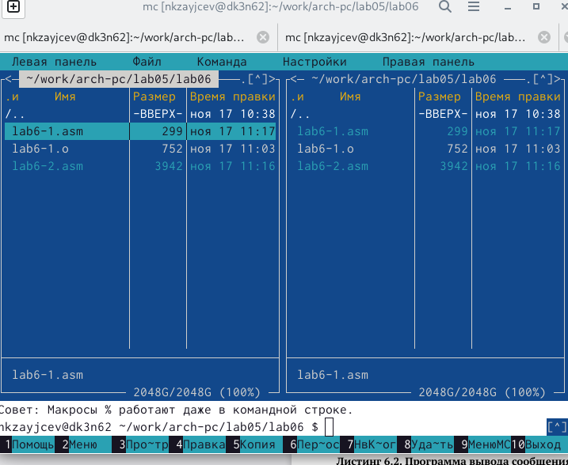

---
## Front matter
title: "Основы работы с Midnight Commander"
subtitle: "Лабораторная работа 6"
author: "Зайцев Никита "

## Generic otions
lang: ru-RU
toc-title: "Содержание"

## Bibliography
bibliography: bib/cite.bib
csl: pandoc/csl/gost-r-7-0-5-2008-numeric.csl

## Pdf output format
toc: true # Table of contents
toc-depth: 2
lof: true # List of figures
fontsize: 12pt
linestretch: 1.5
papersize: a4
documentclass: scrreprt
## I18n polyglossia
polyglossia-lang:
  name: russian
  options:
	- spelling=modern
	- babelshorthands=true
polyglossia-otherlangs:
  name: english
## I18n babel
babel-lang: russian
babel-otherlangs: english
## Fonts
mainfont: PT Serif
romanfont: PT Serif
sansfont: PT Sans
monofont: PT Mono
mainfontoptions: Ligatures=TeX
romanfontoptions: Ligatures=TeX
sansfontoptions: Ligatures=TeX,Scale=MatchLowercase
monofontoptions: Scale=MatchLowercase,Scale=0.9
## Biblatex
biblatex: true
biblio-style: "gost-numeric"
biblatexoptions:
  - parentracker=true
  - backend=biber
  - hyperref=auto
  - language=auto
  - autolang=other*
  - citestyle=gost-numeric
## Pandoc-crossref LaTeX customization
figureTitle: "Рис."
tableTitle: "Таблица"
listingTitle: "Листинг"
lofTitle: "Список иллюстраций"
lotTitle: "Список таблиц"
lolTitle: "Листинги"
## Misc options
indent: true
header-includes:
  - \usepackage{indentfirst}
  - \usepackage{float} # keep figures where there are in the text
  - \floatplacement{figure}{H} # keep figures where there are in the text
---

# Цель работы

Приобретение практических навыков работы в Midnight Commander. Освоение
инструкций языка ассемблера mov и int.

# Задание

Написание программ на языке Assambler

# Выполнение лабораторной работы

При помощи команды mc Midnight Commander

{ #fig:001 width=70% }

При помощи кнопок перешел в папку lab05

{ #fig:002 width=70% }

при помощи  F7 создал папку lab06

{ #fig:003 width=70% }

при поиощи комманды touch создаю файл 

{ #fig:004 width=70% }

при помощи F4 записал на файл нужную программу 

{ #fig:005 width=70% }

Выполнил компоновку объектного файла и запустил получившийся исполняемый
файл

{ #fig:006 width=70% }

Скопировал файл при помощи F5 и переименовал его также

{ #fig:007 width=70% }

Написал комманды 

{ #fig:008 width=70% }

Компоную и запускаю файлы 1 и 2. Разница между них в том , что первая программа запрашивает на след строчку , а вторая на этой же строке 

{ #fig:009 width=70% }

# Задания для самомстоятельной работы
Сделать копию первого файла при помощи F5 

{ #fig:010 width=70% }

Исправить комманды , чтобы после введения текста он появился

{ #fig:011 width=70% }

Проверяем

{ #fig:012 width=70% }

Также при помощи F5 копируем второй файл и изменяем в нем код, чтобы также выводился текст

{ #fig:013 width=70% }

проверяем 

{ #fig:014 width=70% }

# Выводы

В ходе выполнения данной лабороторной работы я приобрел практические навыки работы в Midnight Commander ,а также освоил инструкцию языка ассамблера mov и int.
