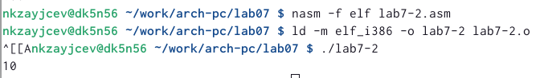

---
## Front matter
title: "Лабороторная работа 7"
subtitle: "Арифметические операции в NASM."
author: "Зайцев Никита Кириллович"

## Generic otions
lang: ru-RU
toc-title: "Содержание"

## Bibliography
bibliography: bib/cite.bib
csl: pandoc/csl/gost-r-7-0-5-2008-numeric.csl

## Pdf output format
toc: true # Table of contents
toc-depth: 2
lof: true # List of figures
fontsize: 12pt
linestretch: 1.5
papersize: a4
documentclass: scrreprt
## I18n polyglossia
polyglossia-lang:
  name: russian
  options:
	- spelling=modern
	- babelshorthands=true
polyglossia-otherlangs:
  name: english
## I18n babel
babel-lang: russian
babel-otherlangs: english
## Fonts
mainfont: PT Serif
romanfont: PT Serif
sansfont: PT Sans
monofont: PT Mono
mainfontoptions: Ligatures=TeX
romanfontoptions: Ligatures=TeX
sansfontoptions: Ligatures=TeX,Scale=MatchLowercase
monofontoptions: Scale=MatchLowercase,Scale=0.9
## Biblatex
biblatex: true
biblio-style: "gost-numeric"
biblatexoptions:
  - parentracker=true
  - backend=biber
  - hyperref=auto
  - language=auto
  - autolang=other*
  - citestyle=gost-numeric
## Pandoc-crossref LaTeX customization
figureTitle: "Рис."
tableTitle: "Таблица"
listingTitle: "Листинг"
lofTitle: "Список иллюстраций"
lotTitle: "Список таблиц"
lolTitle: "Листинги"
## Misc options
indent: true
header-includes:
  - \usepackage{indentfirst}
  - \usepackage{float} # keep figures where there are in the text
  - \floatplacement{figure}{H} # keep figures where there are in the text
---

# Цель работы

Освоение арифметических инструкций языка ассемблера NASM.

# Выполнение лабораторной работы

1. С самого начала я создал папку и файл с расширением .asm
{ #fig:001 width=70% }

2. Потом в данный файл я вписал из листинга 1 и он мне вывел j,что является 112

{ #fig:002 width=70% }

3. Далее как написано в лаборотороной изменил значение двух строк и он вывел мне код 10,который не отобразился на экране

{ #fig:003 width=70% }

4.После этого я создаол еще один файл и вставил текст из листинг 2,что вывело 106

{ #fig:004 width=70% }

5. изменив две строки аналагично,как в предыдущем файле оно вывело мне число 10

{ #fig:005 width=70% }

6. Вывод функции  iprint выводит на тойже строке вместе с терминалом , вот и все различие 

{ #fig:006 width=70% }

7. создаю программу для вычесления функции ,заданные в лабороторной работы и вывожу тот же ответ 

{ #fig:007 width=70% }

8. самостотельно написал программу для решение другого выражения 

{ #fig:008 width=70% }

9. по анналогии с двумя программами я создал третью, которая при введении номера студенческого билета высчитывала номер моего варианта.

{ #fig:009 width=70% }

##Ответы на вопрос:

1. Чтобы вывести эту надпись на экран ,используются строки mov eax,rem call sprint

2. 
a) Инструкция "mov ecx,x" записывает адресы сообщения ,которого вводят в "EAX"
б) Инструкция "mov eвx,80" записывает длину вводимого сообщения в "EBX"
в) Инструкция "call sread" выполняет вызов программы ввода сообщения

3. Эта конструкция испозуется для преоброзование определенного символа в число

4. За само вычесление варианта используются строки : xor edx, edx mov ebx,20 div ebx inc edx

5. Во время выполнения этой конструкции остаток от деления записывается в геристр "EBX"

6. Эта конструкция нужна ,чтобы увеличить значение edx на единицу

7. Для того чтобы вывести вычисления используются строки mov eax,edx call inprintLF

#Задания для самомтоятельной работы 
Я написал программу ,которая соответствовал мой вариант ,а также испробовал на двух различных х , чтобы проверить работоспособность и правильность 

{ #fig:010 width=70% }

# Выводы

За данную лаббороторную работу я научился создавать программы на языке assambler, которые могут высчитывать всевозможные выражение 
