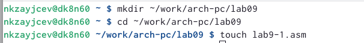
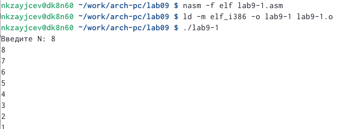
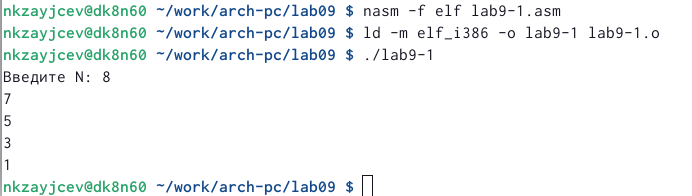
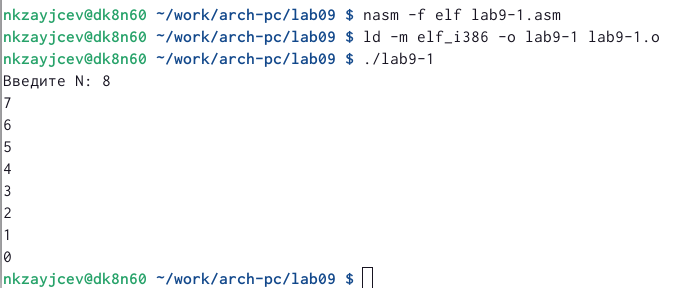
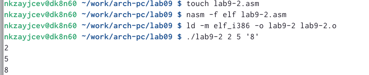
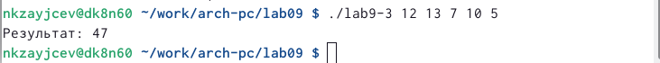
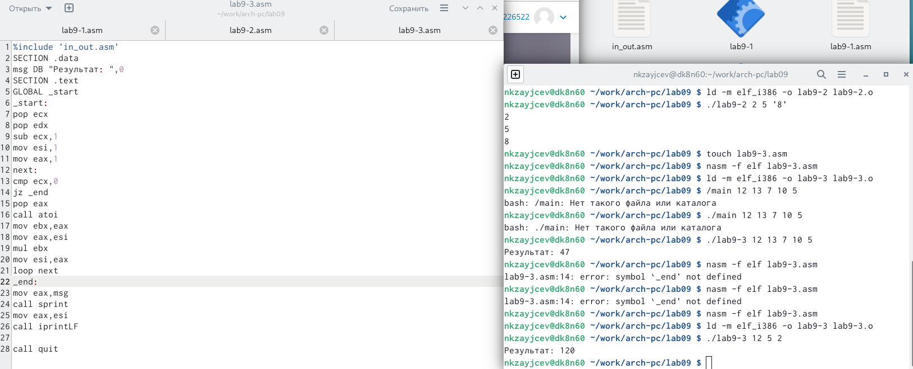
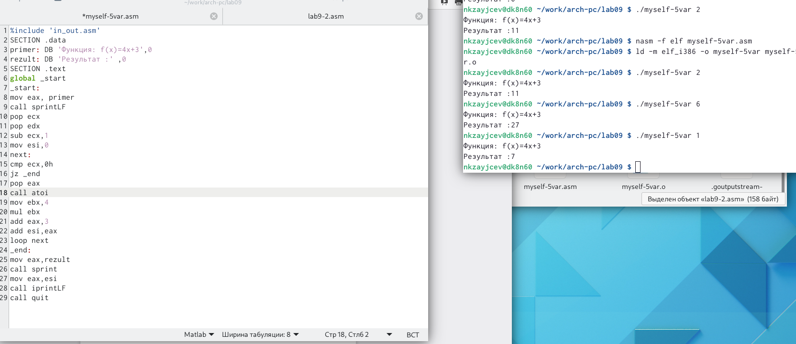

---
## Front matter
title: "Лабораторная работа 9"
subtitle: "Программирование цикла. Обработка аргументов командной строки."
author: "Зайцев Никита Кириллович"

## Generic otions
lang: ru-RU
toc-title: "Содержание"

## Bibliography
bibliography: bib/cite.bib
csl: pandoc/csl/gost-r-7-0-5-2008-numeric.csl

## Pdf output format
toc: true # Table of contents
toc-depth: 2
lof: true # List of figures
fontsize: 12pt
linestretch: 1.5
papersize: a4
documentclass: scrreprt
## I18n polyglossia
polyglossia-lang:
  name: russian
  options:
	- spelling=modern
	- babelshorthands=true
polyglossia-otherlangs:
  name: english
## I18n babel
babel-lang: russian
babel-otherlangs: english
## Fonts
mainfont: PT Serif
romanfont: PT Serif
sansfont: PT Sans
monofont: PT Mono
mainfontoptions: Ligatures=TeX
romanfontoptions: Ligatures=TeX
sansfontoptions: Ligatures=TeX,Scale=MatchLowercase
monofontoptions: Scale=MatchLowercase,Scale=0.9
## Biblatex
biblatex: true
biblio-style: "gost-numeric"
biblatexoptions:
  - parentracker=true
  - backend=biber
  - hyperref=auto
  - language=auto
  - autolang=other*
  - citestyle=gost-numeric
## Pandoc-crossref LaTeX customization
figureTitle: "Рис."
tableTitle: "Таблица"
listingTitle: "Листинг"
lofTitle: "Список иллюстраций"
lotTitle: "Список таблиц"
lolTitle: "Листинги"
## Misc options
indent: true
header-includes:
  - \usepackage{indentfirst}
  - \usepackage{float} # keep figures where there are in the text
  - \floatplacement{figure}{H} # keep figures where there are in the text
---

# Цель работы

Приобретение навыков написания программ с использованием циклов и
обработкой аргументов командной строки

# Выполнение лабораторной работы

1. Создаю файл для программирования

{ #fig:001 width=70% }

2. Добавля в созданный файл текст листинга получаю программу ,которая циклично выводит числа,начиная от записанного числа , уменьшая его на 1.

{ #fig:002 width=70% }

3. Изменив цикл программа начала выводить цифры начиная с числа-1 и последующие -2

{ #fig:003 width=70% }

4. Еще раз немного изменив получаю так ,что цикл начал выводить число-1 ,выичитать из последующего -1 и до 0 включительно, кол-во совпадает

{ #fig:004 width=70% }

5. Создав новую программу и вписав туда аргументы она обработала все 3,выписав их

{ #fig:005 width=70% }

6. Сделав новую программу для сложение аргументов,она сложила их все и вывела результат

{ #fig:006 width=70% }

7. Добавив комманду mul и убрав сложение появилась программа ,которая перемножит все аргументы.

{ #fig:007 width=70% }

Задание для самостоятельной работы варианта 5 

{ #fig:008 width=70% }

# Выводы

За время,которое я делал лабороторную работу я научился создавать программы с циклом,а также использовать его в самых различных ситуациях.

